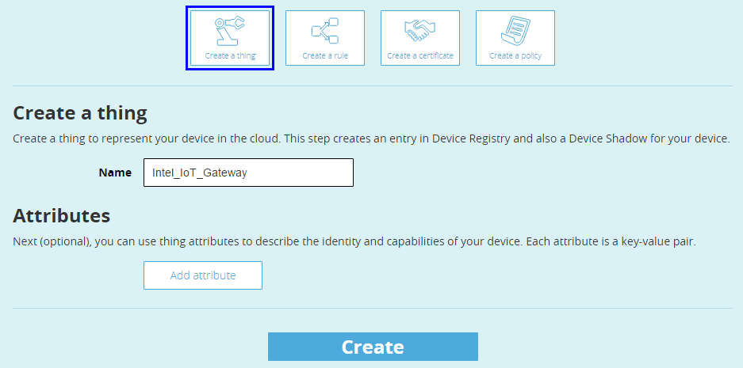
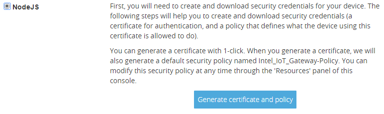
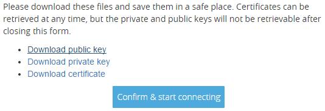
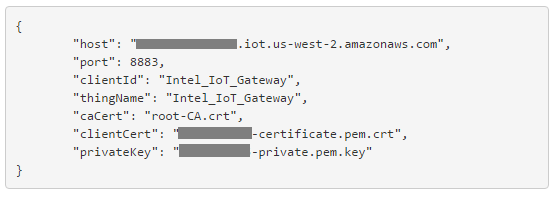

Getting started with IoT - 1
=================

## Setting up AWS IoT ##
Sign up for a new AWS IoT account by logging in with your existing Amazon account or creating a new one by visiting [https://aws.amazon.com/iot/]( https://aws.amazon.com/iot/)

Click to start the interactive tutorial after you log in.

Read through the first part of the tutorial that explains the different parts of the solution (Steps 1–6).  When you are done with that you will be prompted to create a thing:

Click on View Thing

Click on Connect a device:

Choose the NodeJS SDK and then click Generate certificate and policy

Click to download the public key, private key and the certificate to your local computer.  Place them in a directory where you can find them in a future step.  These certificates are what authenticate the IoT gateway and allow it to send data to the AWS IoT cloud.  They will be used later.

Leave this tab in your browser open and in another browser tab navigate back to the Intel® IoT Gateway Developer Hub.  You will need this information for AWS IoT to configure your gateway in the later steps.

## Preparing and connecting the Arduion 101 with Grove Shield ##
-	These steps need to be done from a 2nd system, not the IoT gateway.  In this case, we've running Windows.
-	Install the latest version of Arduino IDE from http://arduino.com
-	Plug in the Arduino 101 and set the IDE to the correct port and board type
-	Load the StandardFirmata sketch from File/Examples/Firmata
	-	As of 1/4/16 (IDE version 1.6.7), the example StandardFirmata sketch would not compile for the Arduino 101 due to missing board reference in the board.h file.  This issue may be fixed by now but if not, an updated board.h file can be found [here](https://github.com/firmata/arduino/blob/master/Boards.h).  Copy this file to C:\Program Files (x86)\Arduino\libraries\Firmata
-	Upload the Example
	-	As of 1/4/16, the IDE will time out trying to communicate with the Arduino 101 during upload.  To workaround this issue, just press the reset button between the USB and Power ports on the Arduino 101 right after you start the upload process.
-	The sketch should compile and upload.  You may see some warnings about SET_PIN_MODE.  These are known issues and can be ignored for this example.
-	Unplug the Arduino 101 and install the Grove Shield.
-	For this example, we'll be using 6 of the sensors from the Grove Shield kit.  Please connect them as follows:
	-	LED to D2
	-	Push Button to D3
	-	Touch Sensor to D6
	-	Temp Sensor to A0
	-	Light Sensor to A1
	-	Rotary Sensor to A2

## Connecting the Arduino 101 ##
Plug the Arduino 101 in to power
Plug the Arduino 101 in to a USB port on your IoT Gateway. On
the console of the IoT gateway you should see a message saying what serial
device was created for the USB interface (it is likely /dev/ttyACM0).
Please make a note of what device was created.

